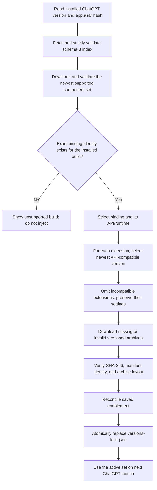
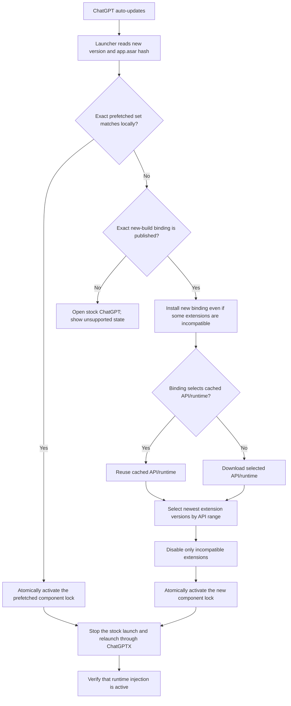

# Component Updates

## Scope

ChatGPTX installs these components independently from GitHub Releases:

- ChatGPT API bridge and runtime
- Exact ChatGPT-build bindings
- Public extensions

The launcher application updates separately through Sparkle. See
[`launcher-updates.md`](launcher-updates.md). The launcher bundle does not
contain a runtime, binding, or extension.

## Selection rule

The launcher resolves one component set in this order:

```text
ChatGPT version + app.asar SHA-256
  -> exact binding
  -> exact ChatGPTX API/runtime
  -> newest version of each extension compatible with that API
```

A binding is valid only for one ChatGPT version and one `app.asar` hash. A
binding selects one exact ChatGPTX API version. Extensions declare only a
`compatibility.chatgptApi` range.

A new ChatGPT build needs a new exact binding. It does not need new extension
releases when the binding continues to provide the same API. A runtime update
continues even when one or more extensions do not support its API. The launcher
leaves those extensions inactive and keeps their settings.

Compatible API fixes and additions use patch or minor versions. Extensions can
use a range such as `^1.0.0` and continue to work. An incompatible API change,
such as removed functionality or a changed lifecycle contract, uses a new major
version. Extensions that do not support the new major version stay inactive.

## Independent fixes

Each component can change without a ChatGPT app update:

- A binding correction increments that build's binding version.
- A runtime or API fix increments the API version and updates the exact
  binding entry that selects it.
- An extension fix increments only that extension version.

The update index generation increments for each published catalog change.

## Update index

CI publishes `updates/latest.json` as the stable `updates` release asset:

```text
https://github.com/zats/chat-gpt-x/releases/download/updates/latest.json
```

Schema 3 contains exact bindings and all published public extension versions:

```json
{
  "schemaVersion": 3,
  "generation": 26,
  "minimumLauncherVersion": "1.1.0",
  "releaseBaseURL": "https://github.com/zats/chat-gpt-x/releases/download",
  "chatgptApis": {
    "1.0.4": {
      "release": "chatgpt-api-v1.0.4",
      "sha256": "<archive-sha256>"
    }
  },
  "bindings": {
    "26.814.41407": {
      "version": "1.0.0",
      "chatgptApi": "1.0.4",
      "asarSha256": "<app-asar-sha256>",
      "release": "binding-26.814.41407-v1.0.0",
      "sha256": "<archive-sha256>"
    }
  },
  "extensions": {
    "thread-colors": {
      "versions": {
        "0.1.10": {
          "compatibility": {
            "chatgptApi": "^1.0.0"
          },
          "release": "extension-thread-colors-v0.1.10",
          "sha256": "<archive-sha256>"
        }
      }
    }
  }
}
```

Each archive URL is:

```text
<releaseBaseURL>/<release>/<release>.zip
```

The catalog retains each published extension version and pins its archive
SHA-256. This lets the launcher select the newest compatible version after an
API major-version change. Private extensions, including `api-test-suite`, do
not enter the public catalog.

Schema 3 starts at ChatGPTX API `1.0.3`. Earlier runtimes expected bindings
inside the runtime archive and cannot load a separate remote binding package.
Their obsolete binding sources and catalog entries are removed.

## Component store

Installed components live under `<Codex home>/extensions`:

```text
extensions/
  components/
    chatgpt-api/<api-version>/.chatgptx-integrity.json
    bindings/<chatgpt-version>/<binding-version>/.chatgptx-integrity.json
    extensions/<extension-id>/<extension-version>/.chatgptx-integrity.json
  state/<extension-id>/
  prefetched/<chatgpt-version>.json
  versions-lock.json
  settings.json
```

`CODEX_HOME` changes the Codex home for development and CI. The default is
`$HOME/.codex`.

Component directories are immutable. `versions-lock.json` schema 1 selects
one exact API, binding, and compatible extension set. Schema 1 is retained
because released runtimes already read this lock contract. The launcher writes
the complete lock only after all selected packages pass validation. Each
component receipt records the verified archive SHA-256 and the SHA-256 of every
extracted file. The launcher rejects a changed, missing, or extra file.

`prefetched/<chatgpt-version>.json` selects the newest published supported
component set. The launcher downloads and validates this set during an update
check, but it does not change the active runtime. If the installed build is
unsupported or is newer than the catalog, the launcher still retains the
newest supported set. Prefetch does not otherwise depend on support for the
currently installed build. The launcher promotes the file only when its
ChatGPT version and `app.asar` hash match the installed app exactly.

`settings.json` maps extension IDs to extensible settings objects:

```json
{
  "schemaVersion": 1,
  "extensions": {
    "thread-colors": {
      "enabled": true
    }
  }
}
```

The store preserves unknown fields and records for extensions that are not
currently compatible. When an extension becomes compatible again, its prior
enablement returns. A required extension is always enabled. Extension state is
separate from extension code. An extension can declare a separate
`contents/settings.js` provider and its namespaced native Settings pane in its
package manifest. The provider loads for an installed compatible extension
even when its feature bundle is disabled. It stores extension-owned values
under `state/<extension-id>/`. Pane, group, and row metadata makes these
settings available through ChatGPT's native Settings search. A declared
extension settings pane does not appear as a separate top-level sidebar item.
The extension manager links to it, Extensions stays selected while it is open,
and the native breadcrumb returns to Extensions.

Obsolete flat package layouts are invalid. The launcher does not migrate or
load them.

## Check-for-updates flow



The exact binding check happens before the index-generation rollback check.
Thus a ChatGPT build change cannot be hidden by a newer cached generation. A
same-generation catalog can select another exact binding during an app update.

## ChatGPT app update flow



## Startup and offline behavior

On startup, the launcher first checks for an exact cached lock. If it exists,
the launcher can inject it without network access. The launcher then checks for
updates in the background. While it remains open, it checks again every ten
minutes. Each valid catalog check downloads and validates the newest supported
component set before it checks support for the installed build. Thus an
unsupported installed build cannot block prefetch. The launcher keeps the set
inactive until the installed app has its exact version and hash. A running
ChatGPT build without a matching active binding triggers an immediate
background check. The check can promote an exact prefetched set without network
access. When the exact runtime becomes active, ChatGPTX stops the stock launch,
relaunches it with runtime injection, and verifies that injection is active.
If no exact runtime is available, ChatGPT continues without extensions and the
launcher shows a notification that the runtime is not supported.

On a clean installation, the launcher downloads the exact remote set. If the
network is unavailable or the ChatGPT build has no exact binding, the launcher
keeps its UI available and can open stock ChatGPT without injection. It never
uses another build's binding.

The updater accepts `CHATGPTX_UPDATE_INDEX_URL` for isolated development and
end-to-end tests.

## Installation and launch safety

The updater:

1. Strictly decodes the index.
2. Checks the minimum launcher version.
3. Matches the exact ChatGPT version and `app.asar` hash.
4. Selects the API and the newest compatible extension versions.
5. Downloads missing or invalid versioned archives.
6. Verifies each archive SHA-256 and expected package manifest.
7. Records the complete extracted file set against that archive SHA-256.
8. Rechecks the receipt before package reuse and active-lock selection.
9. Rejects symbolic links, changed file sets, and path escapes.
10. Preserves extension settings.
11. Writes one atomic active lock last.

At every injected launch, the launcher reads the current lock, package
manifests, and settings. It writes a mode-`0600`, schema-3 launch configuration
with one record for every installed compatible extension. Each record has the
feature entry point, current enablement, and an optional settings-provider
entry point and pane ID. The runtime loads the required extension manager
feature first, then every declared settings provider, then the other enabled
feature bundles.

Component changes take effect on the next ChatGPT launch. If ChatGPT is
running, the launcher offers a restart.

## Local extension development and API tests

The launcher accepts repeatable, launch-scoped development overrides:

```text
--extension <absolute-package-directory-or-main.js>
```

A local extension must be compatible with the selected ChatGPTX API. It
overrides an installed extension with the same ID for that launch only.
An explicit local `extensions` override keeps manager permission and activates
before all other extensions in normal mode. Normal mode can stop and relaunch
the running ChatGPT app. Do not use it from an agent that runs inside ChatGPT.

The launcher bundles the `build-chatgptx-extensions` Codex skill. The
Extension Development control creates this one symbolic link:

```text
~/.codex/skills/build-chatgptx-extensions
  -> <ChatGPTX.app>/Contents/Resources/Skills/build-chatgptx-extensions
```

The control honors `CODEX_HOME`. It does not replace the `skills` directory or
overwrite an existing item. The skill resolves the exact active API from the
component lock, scaffolds and packages an external CommonJS project, and
supplies the supported extension-storage utility.

Extension test mode requires at least one explicit local extension and an
isolated profile:

```text
ChatGPTX --test-extension \
  --extension <absolute-local-extension-package> \
  --user-data-dir=<absolute-temporary-profile>
```

This mode does not stop the primary ChatGPT process. It loads the required
Extensions manager and the explicit local extensions only. It rejects the
reserved `extensions` and `api-test-suite` IDs. Use the bundled skill's test
script because it also creates a temporary Codex home, copies only
the exact active component set and `auth.json`, reuses the primary Computer Use
service, verifies source injection and synchronous activation against a
temporary package copy, and provides an explicit stop command that removes the
complete session. Extension test mode uses the copied component lock and does
not run the updater. It does not expose the signed-in profile through a
remote-debugging port. A successful activation does not prove that the
requested behavior works; verify that behavior in the isolated app. Test only
code that you created or fully reviewed because extensions can use the signed-in
authentication API.

API test mode requires an explicit suite and an isolated profile:

```text
ChatGPTX --test-api \
  --extension <absolute-api-test-suite-package> \
  --user-data-dir=<absolute-temporary-profile>
```

There is no bundled `api-test-suite` fallback.

The isolated local CI run builds the current source components and stages them
in its temporary versioned store before it starts the launcher. This tests
unpublished changes without putting components in the launcher bundle or
requiring their releases to exist before CI can approve them.

## Automated binding retries

The version watcher creates one issue for each unknown ChatGPT build. The
`Rebind ChatGPT` workflow moves the issue from `pending` or `failed` to
`in-progress`. It then prepares the exact stock app before it starts the Codex
agent. The agent cannot download another ChatGPT app.

An authorized repository member can comment `retry` on a failed version issue.
This starts the same full binding flow again. If the failed run created a
candidate branch, the workflow verifies and applies that generated binding
patch to the new `main` base. It also gives the agent the exact prior
end-to-end failure log.
The agent must diagnose and correct that evidence before it runs the full suite
again. The workflow publishes the tested binding, updates the issue to
`success`, and closes the issue only after all required jobs pass.

The `Retry transient rebind failure` workflow handles two exact transient
signatures: GitHub's "hosted runner lost communication" failure annotation and
the known native-UI color-picker timing failure after the same binding passed
its earlier agent and static tests. It reruns only the failed jobs and their
dependent jobs, restores the version issue to `in-progress`, and adds a comment
with the new attempt. It permits one automatic retry, for a maximum of two
attempts. A repeated transient failure leaves the issue failed. Other test
failures, agent failures, timeouts, and cancellations do not start an automatic
retry.

## Publication

CI derives release changes from component paths, builds deterministic archives,
writes their SHA-256 values, and publishes version-addressed releases:

```text
chatgpt-api-v<version>
binding-<chatgpt>-v<version>
extension-<id>-v<version>
```

CI downloads each ZIP and checksum sidecar referenced by the schema-3 catalog.
It verifies the actual ZIP and the sidecar against the catalog SHA-256 before
it replaces the stable index asset. GitHub release assets can be changed when
repository release immutability is not enabled. A later asset change does not
silently install: the launcher rejects the ZIP because its SHA-256 is different.
A new binding does not change extension manifests.

This version fetches the index through HTTPS but does not verify a detached
index signature. Archive SHA-256 checks protect against accidental or later
asset changes, but they do not protect against an attacker who can replace the
index and the matching archives. A built-in signing key and CI-held index
signature are a separate security-hardening change.
